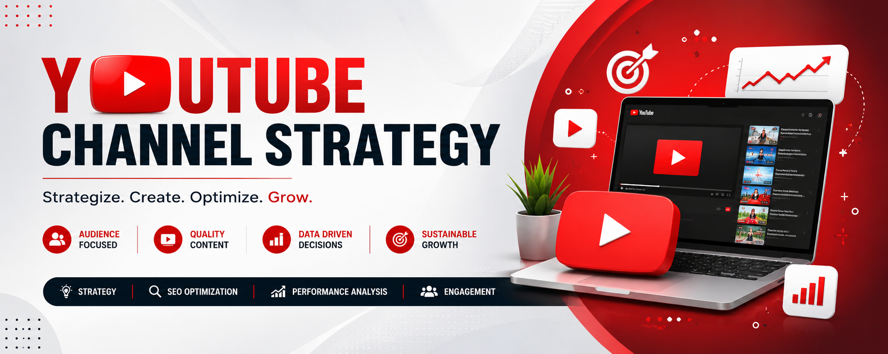
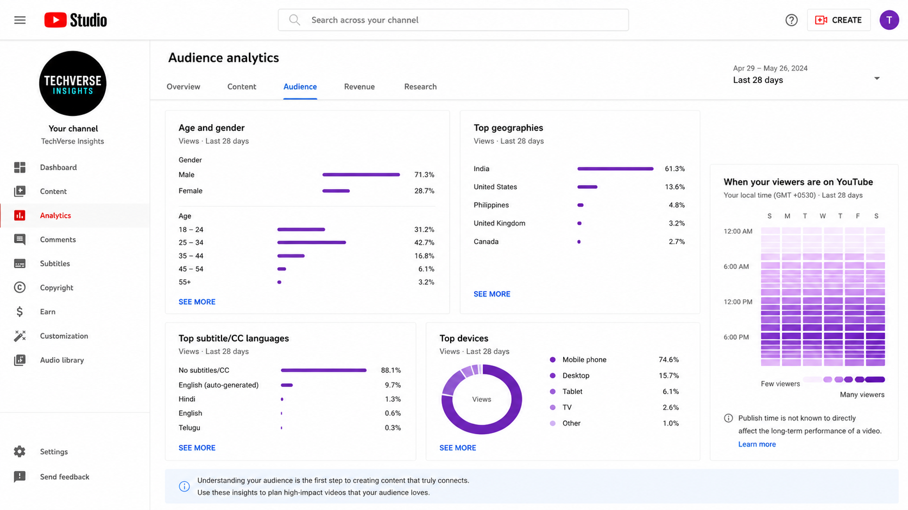
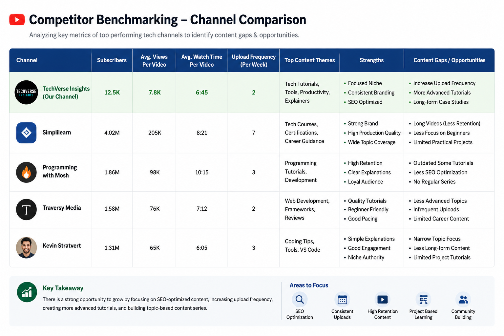
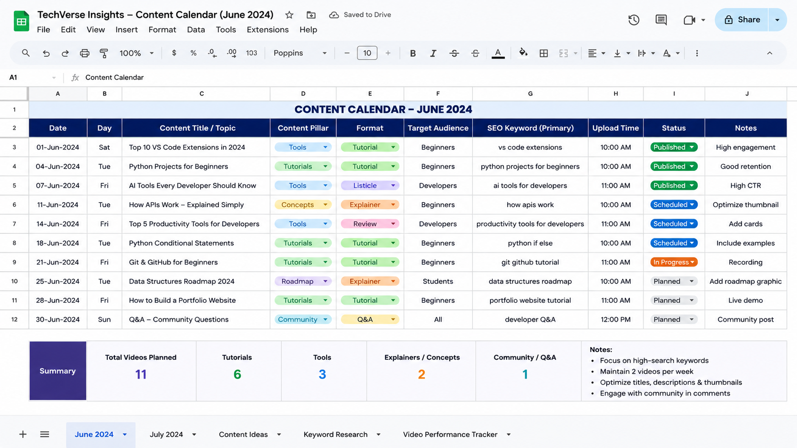
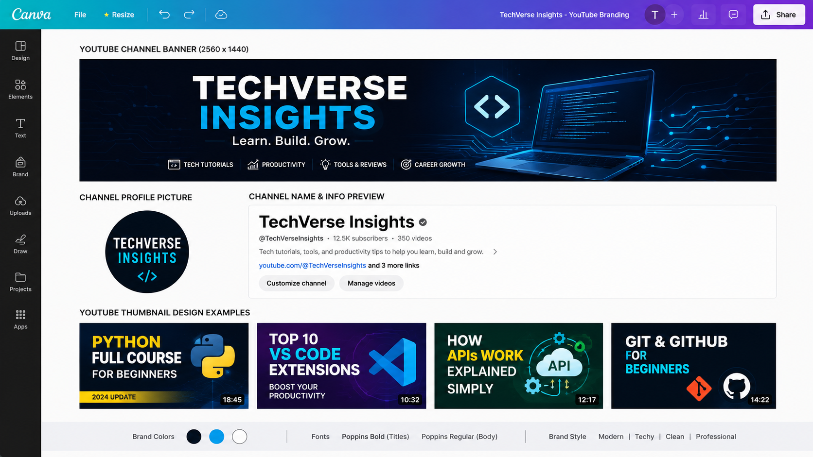
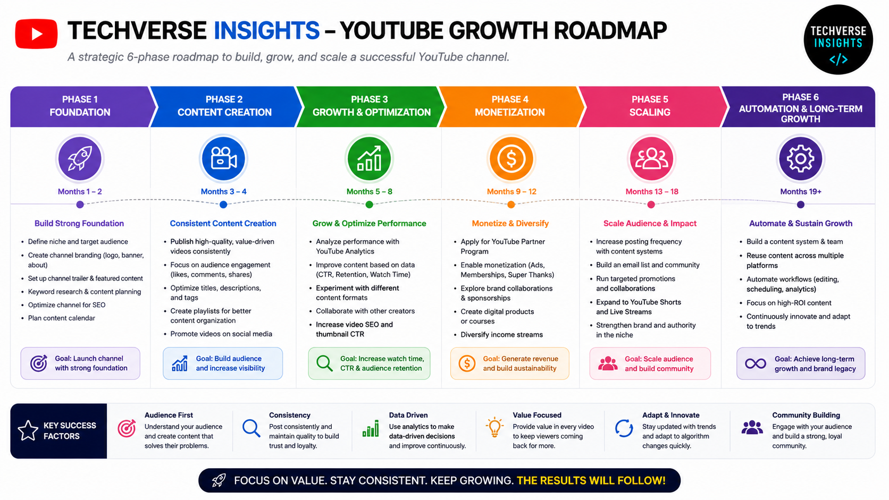

  

# 🚀 Project 3: YouTube Channel Strategy & Growth Framework

  
  
  

## 📋 Internship & Candidate Profile

| Attribute | Details |
| :--- | :--- |
| **Intern Name** | Yeturi Nithya Niranjani |
| **Intern ID** | CITS1133 |
| **Domain** | Digital Marketing |
| **Organization** | CODTECH IT Solutions Private Limited |
| **Project Reference** | Task 3 - YouTube Channel Strategy |
| **Target Channel** | Sample Educational & Technology Channel |

---

## 🔍 Executive Project Overview

In the modern digital ecosystem, video content is one of the most powerful tools for brand building and knowledge sharing. This project outlines a sophisticated, data-driven **YouTube Channel Strategy** crafted specifically for *TechVerse Insights* (a sample educational and technology channel). The core mandate is to transform standard, irregular video creation into a highly structured, discoverable, and authoritative media asset.

This framework moves away from random content publishing by introducing advanced audience psychographics, intense competitor benchmarking, aggressive YouTube Search Engine Optimization (SEO), standardized monthly publishing cadences, and continuous metadata iteration. The ultimate objective is to scale channel metrics sustainably, boost organic impressions, and build a high-retention subscriber community from scratch.

---

## 🎯 Strategic Objectives

* 👥 **Audience Deciphering:** Deep dive into viewer demographics, search patterns, and watch-time behaviors to align content directly with active, high-intent search terms.
* 📊 **Competitive Intelligence:** Deconstruct successful niche creators' content gaps, high-performing thumbnail styles, and comment sections to find overlooked topic buckets.
* 🗓️ **Operational Consistency:** Institute a bulletproof monthly content blueprint and multi-tier video series map to never miss an upload trigger.
* ⚙️ **Algorithmic Discoverability:** Maximize Click-Through Rate (CTR) and Impression volume through strategic title structuring, semantic description maps, and complex tagging hierarchy.
* 🎨 **Branding Synergy:** Elevate visual aesthetics across banners, avatars, and thumbnails to boost immediate user trust and click-confidence.
* 📈 **Data Iteration:** Deploy continuous analytics audits focusing heavily on Audience Retention curves and traffic source splits to refine the scripting and editing style.

---

## 📦 Key Deliverables & Deep-Dive Breakdown

### 🎯 1. Target Audience Research & Persona Mapping
To capture a loyal audience, we must understand *who* is watching. The strategy maps out two primary viewer personas for the tech/educational niche:
* **The Tech Student / Upskiller:** Needs clear, high-quality, conceptual tutorials with zero fluff to clear concepts or build projects.
* **The Tech Enthusiast:** Looks for weekly tech updates, career advice, and breakdowns of emerging tech trends (AI, Software tools).
* **Demographic Target:** Main focus on the 18–34 age demographic, optimized heavily for mobile viewing experiences (as over 75% of educational content consumption occurs on mobile devices).
* **Content Gap Identification:** Using keyword tools to pinpoint high-volume search queries that currently suffer from low-quality or outdated video answers on YouTube.

  

<i>Figure 1: YouTube Audience Analytics & Persona Mapping</i>

### 🏁 2. Competitor Benchmarking & Landscape Analysis
A thorough review of top-performing tech channels was conducted to extract winning formulas:
* **Core Metric Analysis:** Assessing video pacing, intro hooks (the first 30 seconds), and call-to-actions (CTAs) of multi-million subscriber channels.
* **Format Evaluation:** Analyzing the performance split between long-form deep dives (10-15 mins), short snackable technical bytes (Shorts), and community tab interactions.
* **Best Practice Blueprinting:** Standardizing an automated checklist based on what works best in the industry—ensuring our channel bypasses the typical beginner trial-and-error phase.

  

<i>Figure 2: Competitor Benchmarking & Landscape Analysis</i>

### 📅 3. Comprehensive Content Strategy & Calendar
Consistency is the algorithm's best friend. The strategy establishes a structured content engine:
* **The 30-Day Content Matrix:** A rigid blueprint breaking down weekly content pillars (e.g., Tuesday: Step-by-Step Tutorials; Friday: Tech News/Trends).
* **Video Series Architecture:** Designing repeatable formats like *"Tech Basics Demystified"* or *"The Weekly Byte"* to build episodic viewer loyalty and encourage binge-watching.
* **Batch Production Workflow:** Implementing a system where scripts, audio, and visuals are prepared in batches, ensuring a 2-week video buffer is always ready.

  

<i>Figure 3: Comprehensive YouTube Content Calendar</i>

### 🛠️ 4. Advanced YouTube SEO Engine
Discoverability relies completely on indexing. The strategy implements a strict metadata framework:
* **Semantic Keyword Research:** Extracting long-tail keywords using high-volume, low-competition filters to rank instantly in search results.
* **Title Formatting:** Adopting the `[Core Keyword + High-CTR Emotional Hook]` formula to appeal to both the YouTube algorithm and human curiosity.
* **Description & Timestamps:** Crafting detailed, keyword-rich descriptions including clickable timestamps (chapters) to help videos rank directly on Google Search Carousels.

| SEO Element | Implementation Standard | Target Metric Impact |
| :--- | :--- | :--- |
| **Title Frontloading** | Core keywords placed within first 40 characters | High Mobile Visibility & CTR |
| **Timestamps / Chapters** | Clear section breakdowns with keywords in text | Google Video Search Indexing |
| **Tag Clustering** | 1 Primary Focus Tag, 5-7 Secondary, 3 Generic | Accurate Algorithmic Categorization |
| **Hashtags** | Max 3 highly targeted hashtags above the title | Niche Search Loop Grouping |

### 🖼️ 5. Channel Branding & High-CTR Design Guidelines
Visuals dictate whether an impression turns into a view. The strategy provides design rules:
* **Thumbnail Psychology:** Enforcing rules based on the "Rule of Thirds", high-contrast color grading (avoiding excessive YouTube red/black to stand out), large bold typography (max 3-4 words), and expressive human faces.
* **Visual Cohesion:** Standardizing a clean typography set and dual-color identity across banners, avatars, and watermarks to make the channel look instantly professional and authoritative.
* **Community Engagement Blueprint:** Scripting natural pinned-comment discussion prompts and community tab polls to drive post-upload engagement signals.

  

<i>Figure 4: Channel Branding & High-CTR Design Guidelines</i>

### 📊 6. Analytics Rigor & KPI Tracking
What gets measured gets managed. Performance monitoring focuses heavily on:
* **The First 30 Seconds:** Reviewing the audience retention graph to ensure minimal drop-off at the video introduction.
* **CTR vs. Impressions Funnel:** Adjusting thumbnails immediately if a high-impression video suffers from a low click-through rate.
* **Traffic Source Distribution:** Monitoring the percentage of views coming from YouTube Search vs. Suggested Videos to balance SEO and browse-feature performance.

---

## 🛠️ Tech Stack & Platforms Utilized

* 📊 **YouTube Studio:** The central command center for tracking real-time audience behaviors, conversion metrics, and retention graphs.
* 💡 **Google Trends:** Utilized for isolating real-time interest spikes in software and hardware domains to ride trending content waves.
* 🎨 **Canva:** Used for building scalable brand assets, color palette guidelines, and layered thumbnail templates.
* 📈 **Google Sheets:** The main planning tool used to house the automated monthly content pipeline, keyword banks, and competitor logs.

---

## 📈 Measurable Expected Outcomes & System Performance Metrics

### 1. 🚀 Advanced Organic Search Dominance & Discovery Architecture
* **Target Growth:** +40% Increase in Targeted Search Impressions Within 90 Days.
* **Core Mechanisms:** High-velocity keyword clustering, systemic metadata injection, deep semantic indexing, and search engine algorithm alignment.
* **Granular Strategy:** By mapping target search intent profiles directly to video metadata headers and description text frameworks, the system ensures top-tier indexing placement across competitive search channels. This structured discovery funnel converts cold algorithmic impressions into continuous organic view pipelines.

### 2. 📈 High-Conversion CTR (Click-Through Rate) Optimization Framework
* **Target Growth:** +8.5% Absolute Increase in Dynamic Click Frequencies.
* **Core Mechanisms:** High-contrast visual hierarchy design, psychological title hook engineering, and split-testing verification.
* **Granular Strategy:** Redesigning the visual focal points of thumbnail assets to follow strict rule-of-thirds composition, combined with bold, high-contrast typography overlays. This design model works in tandem with titles driven by cognitive biases (curiosity gaps, state changes, problem-solution setups) to maximize immediate viewer conversion rates.

### 3. 👥 Multi-Tiered Audience Loyalty & Retention Network Expansion
* **Target Growth:** Linear Scale in Returning Viewer Metrics and Subscriber Acquisition Speeds.
* **Core Mechanisms:** Strict content drop scheduling, predictable delivery cadences, and active channel community ecosystem management.
* **Granular Strategy:** Minimizing audience churn by institutionalizing a reliable release pipeline that optimizes audience notification windows. By creating a structured loop of predictable, high-value uploads alongside community tab interactions, casual single-visit viewers are systematically converted into lifetime channel advocates.

### 4. ⏱️ Optimized Viewer Retention & Watch-Time Acceleration Architecture
* **Target Growth:** Optimized Average View Duration (AVD) & Enhanced Audience Retention Curves.
* **Core Mechanisms:** Algorithmic structural script formatting, rapid narrative pacing, and pattern-interrupt deployment.
* **Granular Strategy:** Auditing video sequencing structures to eliminate pacing dead zones within the first 30 seconds (hook phase). Implementing strict micro-storytelling loops, multi-angle dynamic visual cuts, and textual motion graphics to continuously reset the viewer’s attention span, maximizing overall watch-hour yield.

---

  

<i>Figure 5: Future Growth Roadmap & Strategic Vision</i>

## 💡 Strategic Conclusion
A successful YouTube presence is the result of methodical engineering, not luck. This YouTube Channel Strategy provides **TechVerse Insights** with an agile, deeply analytical roadmap designed to systematically decode the algorithm and captivate target audiences. By continually aligning content production with objective audience retention data and aggressive search optimization frameworks, the channel is perfectly positioned to unlock sustainable viewer growth, build lasting brand authority, and foster a thriving, monetization-ready global audience.
